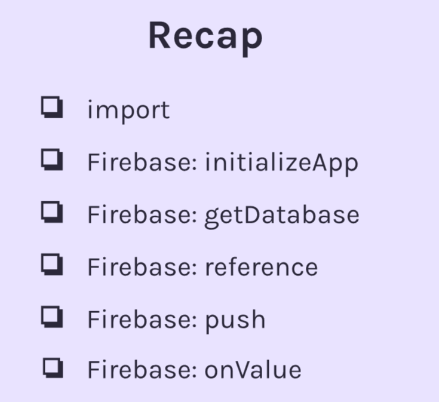
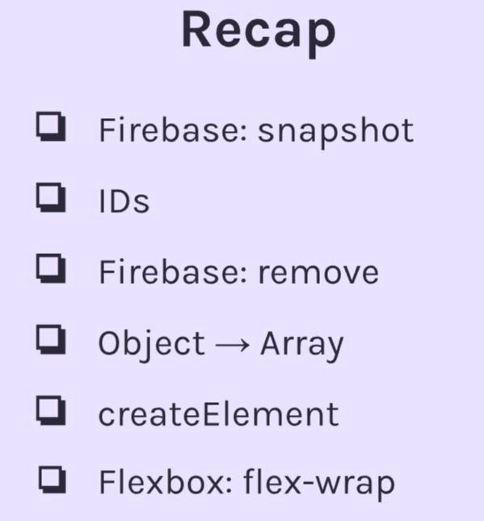
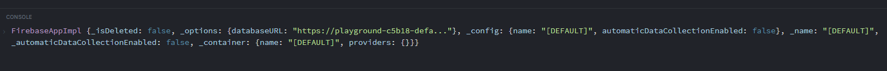

# FIREBASE -- BUILD A MOBILE APP

Module 3, final section -- Started 11/28/2023

Finished 12/15/2023

## Build a Mobile App Summary






## Connecting Firebase DB to JS file

Under imports, add this line of code (in .js file)

```
const appSettings = {
    databaseURL: "https://playground-c5b18-default-rtdb.europe-west1.firebasedatabase.app"
}
```

The databaseURL is located in Firebase on the project.

## Using JS Functions from other files

Let's say we have our main file, index.js, with the following:

```
const inputFieldEl = document.getElementById("input-field")
const addButtonEl = document.getElementById("add-button")

addButtonEl.addEventListener("click", function() {
    let inputValue = inputFieldEl.value

    console.log(`${inputValue} added to database`)
})
```

And we want to use a function from another file. To do so, we have to import it.

Here is our other file, functions.js:

```
export function add(a,b) {
    return a + b
}
```

In our main file, we will add the following line of code at the top:

```
import { add } from "../functions.js"
```

Plain English: Import the add function from the function.js file.

### But there's more. Now, we need to edit our HTML.

We need to add the functions.js file to the bottom of our body, as well as assign type="module" to both.

### You need to add type="module" whenever using import/export

```
<script src="functions.js" type="module"></script>
<script src="index.js" type="module"></script>
```

Now, we can use the add function.

### We still haven't connected our database to our application. Let's do that.

Instead of importing the add function, let's import this

```
import { initializeApp } from "https://www.gstatic.com/firebasejs/9.15.0/firebase-app.js"
```

We we also initialize a const variable called app that uses the function we just imported, taking our appSettings as an argument. Also log it out.

```
const app = initializeApp(appSettings)
console.log(app)
```

We get this message which returns our database URL.


### Almost done...

We will import another function called getDatabase

```
import { getDatabase } from "https://www.gstatic.com/firebasejs/9.15.0/firebase-database.js"
```

And create a new variable called database, which calls this function and uses the app variable as an argument:

```
const database = getDatabase(app)
```

### We need to create a reference to the database. Basically, a location in the database to look for information. Since our DB is empty, we nee

We will make a new variable, and, of course, import another function.

```
import { getDatabase, ref } from "https://www.gstatic.com/firebasejs/9.15.0/firebase-database.js"

const moviesInDB = ref(database, "movies")
```

<b> ref() takes two arguments, which database we are working with, and what the reference should be called. </b>

### Here is our code so far:

```
import { initializeApp } from "https://www.gstatic.com/firebasejs/9.15.0/firebase-app.js"
import { getDatabase, ref } from "https://www.gstatic.com/firebasejs/9.15.0/firebase-database.js"

const appSettings = {
    databaseURL: "https://playground-c5b18-default-rtdb.europe-west1.firebasedatabase.app"
}

const app = initializeApp(appSettings)
const database = getDatabase(app)
const moviesInDB = ref(database, "movies")

console.log(app)

const inputFieldEl = document.getElementById("input-field")
const addButtonEl = document.getElementById("add-button")

addButtonEl.addEventListener("click", function() {
    let inputValue = inputFieldEl.value

    console.log(`${inputValue} added to database`)
})
```

### This is great, but we don't have any code that pushes our input to the database. Let's do that. We need to import another function. Simply add it alongside getDatabase and ref.

```
import { getDatabase, ref, push } from "https://www.gstatic.com/firebasejs/9.15.0/firebase-database.js"
```

### Alright, let's push a value.

### Push takes two arguments, the reference, and our value...

### And it works!

Heres a summary with the code:

```
<!-- IMPORTS  -->
import { initializeApp } from "https://www.gstatic.com/firebasejs/9.15.0/firebase-app.js"
import { getDatabase, ref, push } from "https://www.gstatic.com/firebasejs/9.15.0/firebase-database.js"

<!-- FIREBASE URL TO CONNECT -->
const appSettings = {
    databaseURL: "https://playground-85302-default-rtdb.firebaseio.com/"
}


const app = initializeApp(appSettings)
<!-- app contains our database URL -->
const database = getDatabase(app)

<!-- ref(database, what to call location/reference) -->
const moviesInDB = ref(database, "movies")

const inputFieldEl = document.getElementById("input-field")
const addButtonEl = document.getElementById("add-button")

addButtonEl.addEventListener("click", function() {
    let inputValue = inputFieldEl.value

    <!-- push(reference, value) -->
    push(moviesInDB, inputValue)

    console.log(`${inputValue} added to database`)
})
```

### Turn Object into Array

Using the Object keyword allows us to manipulate it.

```
let scrimbaUsers = {
    "00": "sindre@scrimba.com",
    "01": "per@scrimba.com",
    "02": "frode@scrimba.com"
}
```

Convert object to array based on values

```
Object.values(scrimbaUsers)
// ["sindre@scrimba.com", "per@scrimba.com", "frode@scrimba.com"]
```

Convert object to array based on keys

```
Object.keys(scrimbaUsers)
// ["sindre@scrimba.com", "per@scrimba.com", "frode@scrimba.com"]
```

Convert object to array based on entries. Creates an array of arrays

```
Object.entries(scrimbaUsers)
// [["00", "sindre@scrimba.com"], ["01", "per@scrimba.com"], ["02", "frode@scrimba.com"]]
```

### Fetching data from Firebase using onValue

Import onValue

```

```

```
onValue(reference, function(snapshot)){
    let array = Object.values(snapshot.val())
    console.log(array)
}
```

## CSS Flex-wrap

Flex wrap allows you to "wrap" content, basically like word wrap.

```
// options: wrap, nowrap (deafult), wrap-reverse
.thumbnails {
    display: flex;
    flex-wrap: wrap;
}
```

## CSS Gap

Gap is used with flexbox to create margins around each child element

```
.class{
    gap: 20px 10px;
    // top/bottom, left/right
}
```

## Flex-grow

Let's child items take up full space

```
.class{
    flex-grow: 1;
}
```

## createElement

Creates an element. To do so, provide what element you would like to make. We create an li element, then set the text content. Aftwards, we appended it to a parent element.

```
let newEl = document.createElement("li")

newEl.textContent = "Desired text"

shoppingListEl.append(newEl)

```

## Removing items from Firebase

First, import remove.

Then, to remove anything, you need to provide the exact location in the DB.


```
let exactLocationInDB = ref(database, `newsStories/${ITEMID}`)
remove(exactLocationInDB)
```

## Firebase -- snapshot.exists() method

.exists() tests if something isn't null. We can use this to ensure deletion of all database entries. Since, if you try to delete every entry, you will also delete the snapshot and will recieve an error.

```
if (snapshot.exists()) {
    //evaluates to true
}
```

## CSS - user-select property

Disable user from selecting elements (like highlighting them)

```
h1 {
    user-select: none;
}
```

## Setting the viewport
Viewport is necessary to set the width on different screens. Add this line to the header
```
<meta name="viewport" content="width=device-width, initial-scale=1.0">
```
Here is a link that does a quick explaination:

https://www.youtube.com/watch?v=SElOdK2qTpI&ab_channel=KevinPowell


## Favicon (Faav-icon)
1. Make sure image is square
2. Make sure it's PNG
3. https://favicon.io/
4. Select PNG -> ICO
5. Upload img
6. Unzip file and upload to project. Paste provided HTML into head

## Web manifest file
Example of before and after formatting:

### Before
```
{"name":"","short_name":"","icons":[{"src":"/android-chrome-192x192.png","sizes":"192x192","type":"image/png"},{"src":"/android-chrome-512x512.png","sizes":"512x512","type":"image/png"}],"theme_color":"#ffffff","background_color":"#ffffff","display":"standalone"}
```

### After
```
{
    "name": "Cat App",
    "short_name": "Cat App",
    "icons":
        [
            {"src":"/android-chrome-192x192.png","sizes":"192x192","type":"image/png"},{"src":"/android-chrome-512x512.png","sizes":"512x512","type":"image/png"}
        ],
    "theme_color": "#ffffff",
    "background_color": "#ffffff",
    "display": "standalone"
}
```