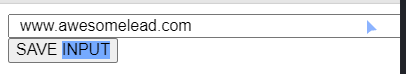

# Random numbers

```
Math.floor(Math.random()* 10) + 1;
```

### Gives number between 1 to 10

# Conditionals

```
if(condition){

}
else if(condition){

}
else{

}
```

# QuerySelector

```
let newName = document.querySelector("CSS Selector")

Examples:
let newName = document.querySelector("body") // selects body element
let newName = document.querySelector(".sum-el") // selects element with class sum-el
let newName = document.querySelector("#sum-el") // selects element with id sum-el
```

# Array

```
let array = [] //initialize

array.push(1) //append to array

console.log(array) // 1

array.pop() //removes last value

console.log(array) // []
```

### Shift / Unshift

```
let array = ["Tuvalu","India","USA","Indonesia","Monaco"]

array.shift() // removes first value, Tuvalu
array.unshift("China") // appends China to front

array.pop() // removes last value, Monaco
array.push("Pakistan") // appends Pakistan to back

console.log(array) // ["China", "India", "USA", "Indonesia", "Pakistan"]
```

# For Loops

```
     START          FINISH      STEP SIZE
for (let count = 1; count < 11; count += 1 ){
    console.log(count)
}
```

# Conditions

```
let hasCompletedCourse = true
let givesCertificate = true

 <!-- && Means both conditions have to be true -->
if (hasCompletedCourse === true && givesCertificate === true) {
    generateCertificate()
}

<!-- || Means one OR the other condition has to be true -->
if (hasCompletedCourse === true || givesCertificate === true) {
    generateCertificate()
}

<!-- ! Means not, both conditions must be false for expression to be true -->
if (!(hasCompletedCourse && givesCertificate)) {
generateCertificate()
}
```

# Objects

Composite / complex data type

```
let player = {
    ///initilize

<!-- KEY   VALUE -->
    name: "Per",
    chips: 145
}
      <!-- dot-notation -->
console.log(player.name) // Per
console.log(player.chips) // 145

        <!-- bracket notation -->
console.log(player["name"]) // Per
```

# Width

Width adds on padding. Setting 100% width and 10px padding would break element from container



```
input {
    width: 100%; /* 100% + 10px + 10px */
    padding-left: 10px;
    padding-right: 10px;
}
```

### So, we use box-sizing property

```
input {
    width: 100%; /* 100% + 10px + 10px */
    padding-left: 10px;
    padding-right: 10px;
}
```


# addEventListener()

Example of grabbing HTML element and adding event listener:

```
inputBtn.addEventListener("click", function() {
    <!-- function content -->
})
```

# Const vs. Let

Const - use when variable isn't meant to be reassigned. When possible, use this.

Let - when variable is meant to be reassigned

# Getting value from input

Basically, once you grab element use .value on it.

```
let myLeads = []
const inputEl = document.getElementById("input-el")
const inputBtn = document.getElementById("input-btn")

inputBtn.addEventListener("click", function() {
    myLeads.push(inputEl.value)
})
```

# InnerHTML / createElement

How to insert HTML using JavsScript

### Here are the variables we work with

```
let myLeads = ["www.awesomelead.com", "www.epiclead.com", "www.greatlead.com"]
const ulEl = document.getElementById("ul-el")
```

### InnerHTML

ulEL is an unordered list. Using innerHTML, we insert a list item from the array. This line injects HTML into the DOM.

```
ulEl.innerHTML += "<li>" + myLeads[i] + "</li>"
```

### document.createElement()

First, we create a variable which stores the li element. Next, we append the text we want to the element using li.textContent. Finally, we append the new list item to our unordered list.

```
const li = document.createElement("li")
li.textContent = myLeads[i]
ulEl.append(li)
```

### "DOM Manipulation comes with a cost"

Better to run innerHTMl once rather than several tiems within a for loop. For example:

```
let listItems = ""
for (let i = 0; i < myLeads.length; i++) {
    listItems += "<li>" + myLeads[i] + "</li>"
}
ulEl.innerHTML = listItems
```

Doing it this way, rather than the first example code (which was inside a for loop), saves time. This code has to run innerHTML once, when the former does 3 times.

# Template Strings / Literals

Use `` backticks

Instead of this

```
listItems += "<li><a target='_blank' href='" + myLeads[i] + "'>" + myLeads[i] + "</a></li>"
```

We can use template strings...

```
`<li><a target='_blank' href='${myLeads[i]}'>${myLeads[i]}</a></li>`
```

You can break it onto different lines!

```
`
<li>
    <a target='_blank' href='${myLeads[i]}'>
        ${myLeads[i]}
    </a>
</li>
`
```

### ${ } to use variables inside string. Inside template strings, there is no + for concatenation, or quotes. Unless you are inserting HTML or instances where quotes are needed outside of displaying a string.

# CSS Specificity

Sometimes we don't want to affect all elements when using a general selector. We can create more specific selectors in this case.

```
li a {
    color: #5f9341;
}
```

This selects links only inside a list-item.

# LocalStorage -- Working with JSON and Arrays

LocalStorage only works with strings, so we need to convert our array.

```
let myLeads = `["www.awesomelead.com"]`

// 1. Turn the myLeads string into an array
myLeads = JSON.parse(myLeads)
// 2. Push a new value to the array
myLeads.push("www.lead2.com")
// 3. Turn the array into a string again
myLeads = JSON.stringify(myLeads)
// 4. Console.log the string using typeof to verify that it's a string
console.log(typeof myLeads)

//string

localStorage.setItem("myLeads", JSON.stringify( myLeads ) )
```

# Truthy / Falsy Values

These values are false.

```
// false
// 0
// ""
// null -> how you as a developer signalize emptiness
// undefined -> how JavaScript signalizes emptiness
// NaN
```

Developers set values to null to signify emptyness. JS will return these values as undefinied.

Arrays will return true, even if empty.

# Function Parameters & Arguments

Pass a value through a function, allows for reuseability vs. hard coding values. To add more than one, use commas

```
const names = ["Dylan", "Karl", "Briana"]
const age = 20
<!--             Parameters -->
function render(param1, param2){
    console.log(param1)
    console.log(param2)
}
<!--    Arguments -->
render(names, age)
// ["Dylan", "Karl", "Briana"]
// 20
```
