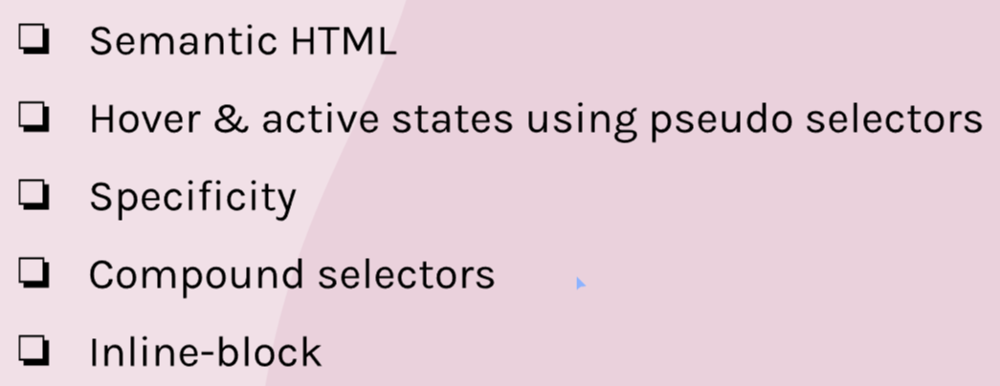
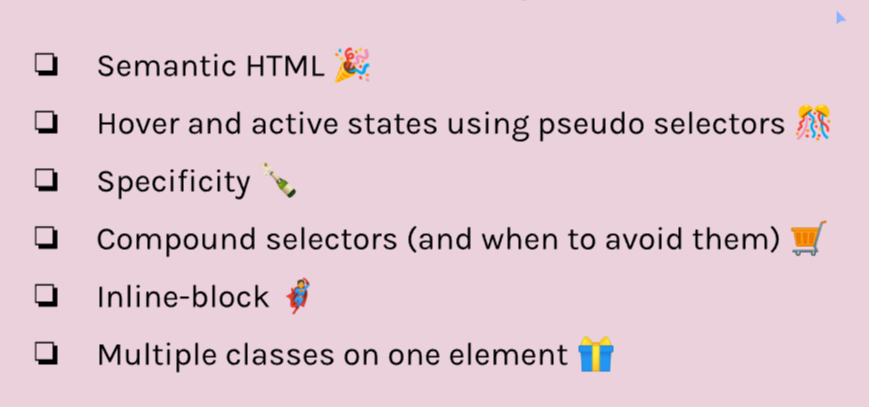
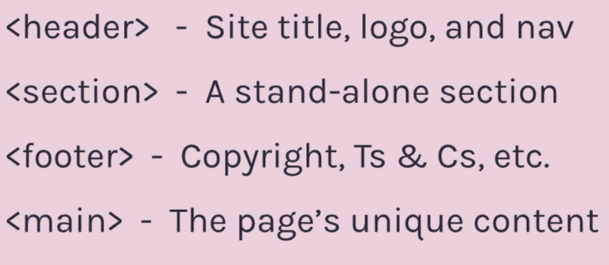
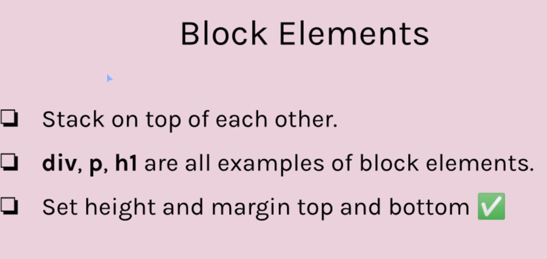
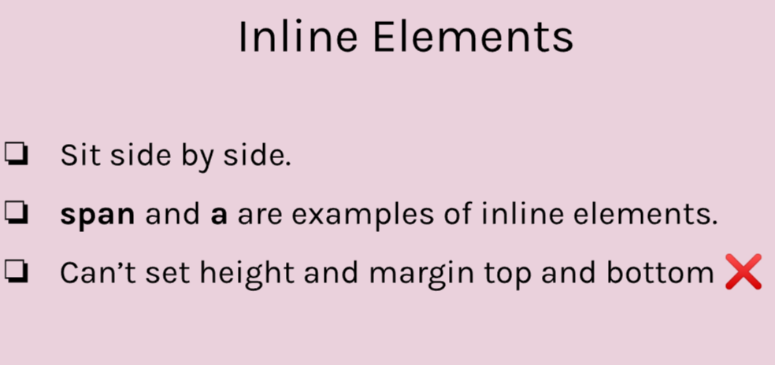
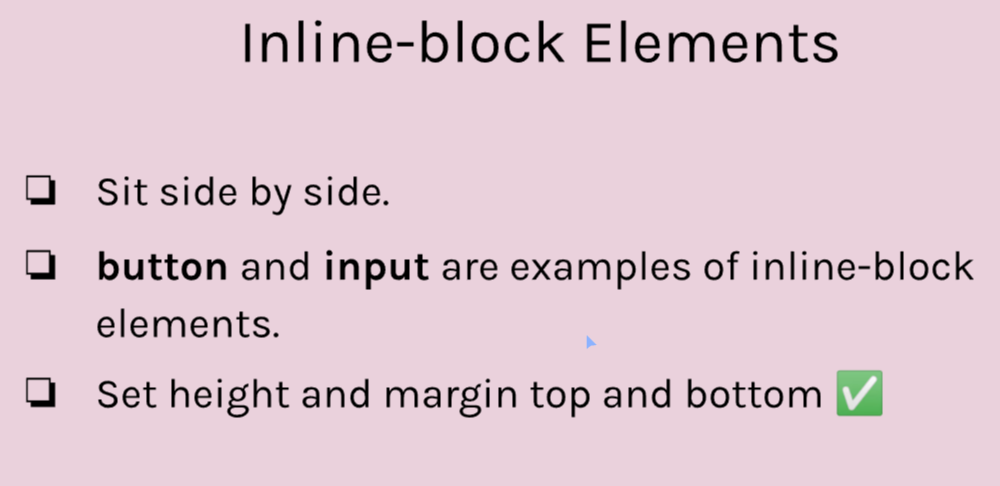

# Module 4 - Bulid an NFT Site

Started 12/17/2023

Finished 12/30/2023
# Overview





## Semantic HTML

Using more descriptive tags which explain the content they hold. Main ones are:


### Why use Semantic HTML?

- Better accessibility
- Makes our code more readable
- Better for SEO (Search engine optimization)

## Margins
When an element touches its parent, its top and bottom margins will merge with the margins of the parent element.

Adding padding to the parent will elimnate this issue.

Does not happen with grid and flexbox.

## Cool Knowledge

- H2 element will default to 1.5x font-size set on body

## Hover and active states

### Pseudo Selector
```
a:hover{
    ///
}

```

## Inline-block
Block elements:


Inline Elements:


Inline-block Elements:


