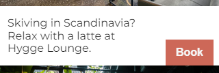

# Module 4 - Bulid a Coworking Space Site

Started 01/02/2024 Happy New Year!!

Finished 01/03/2024

# Overview


## Margin auto on flexbox children


We can set a child element inside a flex container to 9 positions. Top left, top middle, top right, mid left, etc...

To do this, simpoly use margin auto and the opposite direction. For example, to position something in the bottom left, you would use
```
margin-right: auto;
margin-top: auto;
```

To center something in the middle, use:
```
margin-top: auto;
margin-right: auto;
margin-bottom: auto;
margin-left: auto;
```

Of course, we can shorten this to:
```
margin: auto;
```

### Img in CSS instead of HTML

When placing an img using CSS instead of HTML, screenreaders won't pick it up. To avoid this, put the img in the hTML. Another way would be adding the "role" and "aria-label" attribute, like so:

```
<div class="meme-container" role="img" aria-label="A cheeky smiling dog with text saying 'when the cat gets blamed for something you did'.">
    <div class="meme-text">
        <h1>
            When the cat gets blamed for something you did
        </h1>
    </div>
</div>
```

Setting the role on the first div will make a screen reader skip over all the child elements. So having a descriptive aria-label which covers all the child elements is important.

## Position: relative & absolute
Imagine we have a container with content inside.


Now, we want to place the highlighted content, still within the container, on top of another element.


To do this, we need to add the following properties to it.

```
position: absolute
top: 0
left: 0
```


This pushes it outside the container! Which isn't what we want. This happened because once using position: absolute, the fact the elements HTML is inside a container becomes irrelevant. And since it's set to 0 pixels from the top/left.

To fix this, we can change the container to:
```
position: relative
```


NOTE: Setting an element to postion:absolute gives it properties of an inline element.

### White space under images
 Explaination: https://www.youtube.com/watch?v=plOl7TNc89A&ab_channel=KevinPowell

Sometimes, images will have a small white space below it.


Images are inline elements, and in the old days of the web, it was common to have images with text. When placing an image within text, you will see it lines up perfectly, and leaves some space under it as letters like p, q, or y go below the midline.


To get rid of this space, set the img to 
```
display: block;
```

## Align-self

Allow us to take control of an individual elements alignment when it's inside a flex container.

Here's what we have:


Add align-self:


Set it to flex-start:


Set it to flex-end:



Stretch (default):


Center:


## Position: fixed

Fixed positions an element relative to a window and locks it regardless of scrolling.

Setting position: fixed without setting top/left/right/bottom, will move it outside the browser window. 

To center it on the middle of the page, set all directions to 0 and set margin to auto.

```
top: 0;
bottom: 0;
left: 0;
right: 0;
margin: auto;
```

## z-index
Resource; https://scrimba.com/learn/frontend/aside-z-index-co9d34490921adea165eec5ae


We have a stack of cards, each stacked on one another.


Creating a pseudo selector and setting z-index to 1 allows us to hover on a card and bring it to the front.
```
.card:hover {
    z-index: 1;
}
```


The highest number of z-index will be at the front.


Here, King has an index of 2 while Jack has an index of 1. Numbers can be negative as well. These stacks are called <B>stacking contexts</b>

The default value of z-index is auto, or 0. This is inherited from HTML. That's why a negative value on a container (that hasn't changed default value) will make than element dissapear.

#### An element in a stacking context will never stack behind the element that sets the stacking context.
