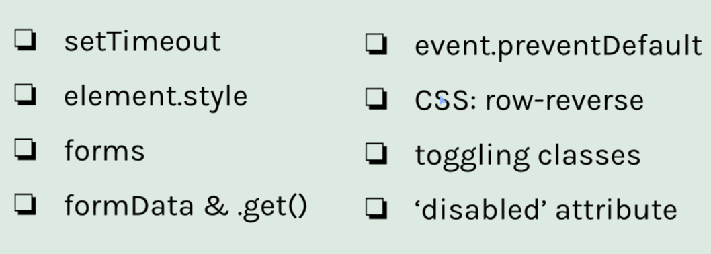
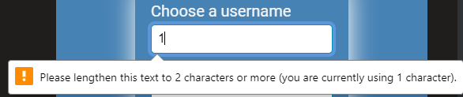

# Cookie Consent Mod5. Sec1

Started 01/04/2024

Finished

## Overview



## setTimeout Method

Allows blocks of code execute later in the flow.

```
// delay is in ms

setTimeout(function(){
    console.log("Lima")
}, delay)
```

## element.style

Target an elements style with Javascript

<b> Syntax:

targetElement.style.property = 'property value' </b>

```
const revealBtn = document.getElementById('reveal-btn')
const answer = document.getElementById('answer')
const question = document.getElementById('question')

revealBtn.addEventListener('click', function(){
    answer.style.display = 'block'
    question.style.backgroundColor = '#68e1fd'
    question.style.color = '#1434A4'
})
```

## Forms

Getting input from users

Syntax to create a form:

```
<form>
    <label for="astronautName">Astronaut Name</label>
    <input type="text" id="astronautName" name="astronautName" placeholder="Neil Armstrong">
</form>
```


The for property allows you to click the label and highlight the input.

Input types reference: https://www.w3schools.com/html/html_form_input_types.asp

### Submitting Forms

There are two ways to create a submit in a form.

Simply adding a button will automatically register as a submit button. (Adding a type="submit" on the button will help make it readable.)

```
<button type="submit">submit</button>
```

Another way is to use the submit type input.

```
<input type="submit">
```

### Required input

To make a field required, simply add the required property to the input.

```
<input
    type="text"
    id="astronautName"
    name="astronautName"
    placeholder="Neil Armstrong">
    required
    >
```

### Validation Attributes

For text input, you can set min/maxlength property to restrict input.

Minlength will provide a popup, shown below.

Maxlength will simply restrict further input after x characters.

```
<input
    required
    type="text"
    id="astronautName"
    name="astronautName"
    placeholder="Neil Armstrong"
    minlength="2"
    >
```



For numbers, use the min/max properties. These both show popups when input is incorrect.

```
<input
    required
    type="number"
    id="astronautAge"
    name="astronautAge"
    placeholder="21"
    min="21"
    max="120"
    >
```

### Form pattern regex (regular expresssion)

Pattern property allows you to restrict input characters or length.

Resources for regex values:

<ul>
    <li><a>https://www.w3schools.com/tags/att_input_pattern.asp</a></li>
    <li><a>https://developer.mozilla.org/en-US/docs/Web/JavaScript/Guide/Regular_expressions </a></li>
</ul>

Ex. limiting input to capital/lowercase letters and required to be 3 characters long.

```
<input pattern="[a-zA-Z]{3}">
```

### preventDefault Method

Prevent default allows us to stop default form behavior. Normally, when submitting a form, the information is put into the url query and the page refreshes. We can stop this with preventDefault.

When the submit action is recorded, pass the event into the function and preventDefault(). e = event

```
const loginForm = document.getElementById('login-form')

loginForm.addEventListener('submit', function(e){
    e.preventDefault()
})
```

Now, our information stays in the form. We can do what we want with it.
