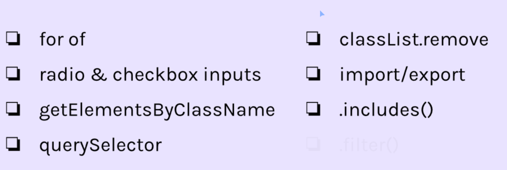
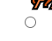

# Meme Picker Mod5. Sec2

Started 01/06/2024

Finished

## Overview



## For of loop
Let's say we have an array
```
const characters = [
    {
        title: 'Ninja',
        emoji: '🥷',
        powers: ['agility', 'stealth', 'aggression'],
    },
    {
        title: 'Sorcerer',
        emoji: '🧙',
        powers: ['magic', 'invisibility', 'necromancy'],
    },
    {
        title: 'Ogre',
        emoji: '👹',
        powers: ['power', 'stamina', 'shapeshifting'],
    },
    {
        title: 'Unicorn',
        emoji: '🦄',
        powers: [ 'flight', 'power', 'purity'],
    }
]
```

We want to iterate over the inner array inside each object. Instead of a nasty for loop, we can use a for of.

```
          object       main array
for (let character of characters){
    console.log(character.title)
}


›Ninja
›Sorcerer
›Orgre
›Unicorn
```

And if we want to get a list of all the powers, from each object:
```
for (let character of characters){
    for (let power of character.powers){
        console.log(power)
    }
}

›stealth
›aggression
›magic
›invisibility
›necromancy
›power
›stamina
›shapeshifting
›flight
›power
›purity
```

## import and export data
- Create new file called data.js which contains our array.
- Add export to the array
```
export const dinnerPartyGuests = [
    'Elvis Presley', 
    'The Queen of England',
    'Alan Turing', 
    'Nelson Mandela', 
    'Mahatma Gandhi', 
    'Aristotle',
    'Albert Einstein'
    ]
```

- In the file we want to use this data, use the import and from keywords.

```
import { dinnerPartyGuests } from '/data.js'
```

Lastly, in index.html, update our script tag with type="module"
```
<script src="index.js" type="module"></script>
```

## Radio input
Input is not limimted to forms.
```
<input type="radio">
```


## includes() method