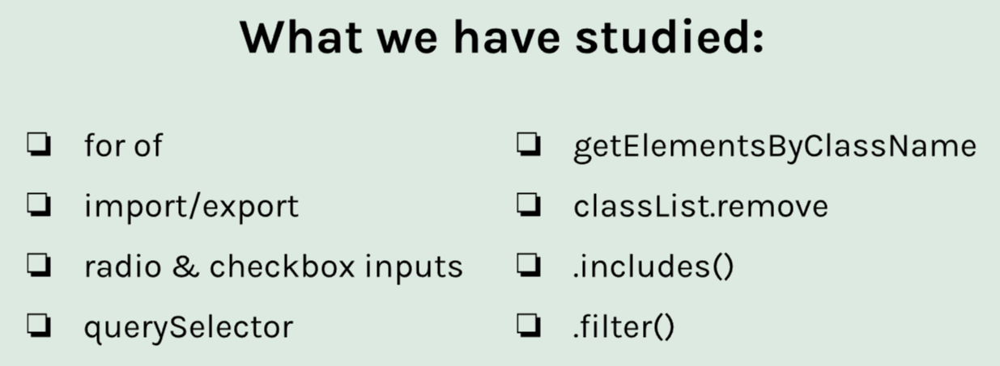
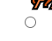
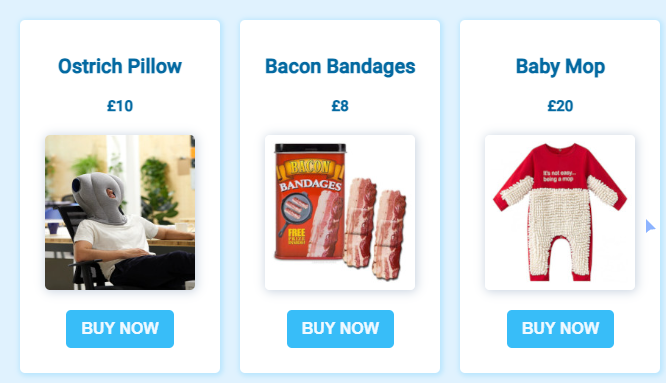
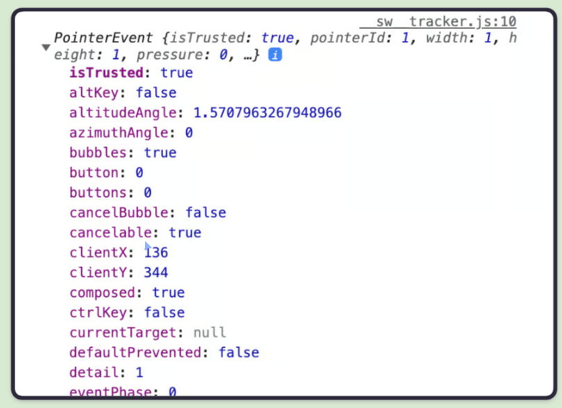
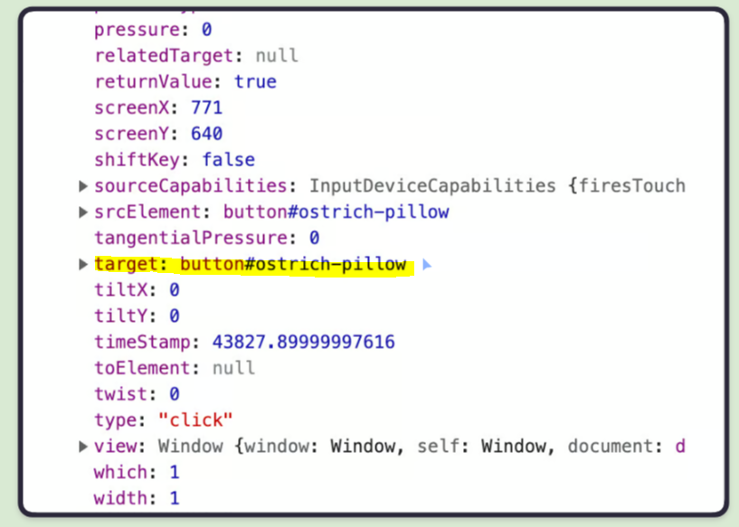
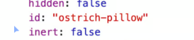
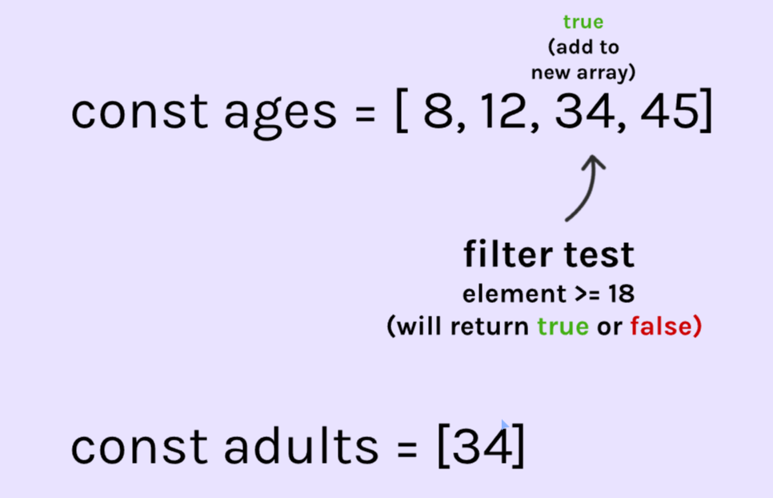
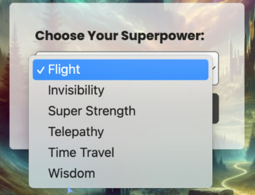
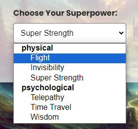

# Meme Picker Mod5. Sec2

Started 01/06/2024

Finished 01/07/2024

## Overview



## For of loop

Let's say we have an array

```
const characters = [
    {
        title: 'Ninja',
        emoji: '🥷',
        powers: ['agility', 'stealth', 'aggression'],
    },
    {
        title: 'Sorcerer',
        emoji: '🧙',
        powers: ['magic', 'invisibility', 'necromancy'],
    },
    {
        title: 'Ogre',
        emoji: '👹',
        powers: ['power', 'stamina', 'shapeshifting'],
    },
    {
        title: 'Unicorn',
        emoji: '🦄',
        powers: [ 'flight', 'power', 'purity'],
    }
]
```

We want to iterate over the inner array inside each object. Instead of a nasty for loop, we can use a for of.

```
          object       main array
for (let character of characters){
    console.log(character.title)
}


›Ninja
›Sorcerer
›Orgre
›Unicorn
```

And if we want to get a list of all the powers, from each object:

```
for (let character of characters){
    for (let power of character.powers){
        console.log(power)
    }
}

›stealth
›aggression
›magic
›invisibility
›necromancy
›power
›stamina
›shapeshifting
›flight
›power
›purity
```

## import and export data

- Create new file called data.js which contains our array.
- Add export to the array

```
export const dinnerPartyGuests = [
    'Elvis Presley',
    'The Queen of England',
    'Alan Turing',
    'Nelson Mandela',
    'Mahatma Gandhi',
    'Aristotle',
    'Albert Einstein'
    ]
```

- In the file we want to use this data, use the import and from keywords.

```
import { dinnerPartyGuests } from '/data.js'
```

Lastly, in index.html, update our script tag with type="module"

```
<script src="index.js" type="module"></script>
```

## Radio input

Input is not limimted to forms.

```
<input type="radio">
```



## includes() method

A method for checking if an array holds a given value

```
const emojis = ['🐥','🐯','🐼']
console.log(emojis.includes('🐥'))

›true

console.log(emojis.includes('🐴'))

›false
```

## event.target.id

We have this e-commerce page with dynamically loaded content.


Currently, our buttons do not have any functionality built in. We know that we are able to add event listeners, but this takes awhile as it most be done individually.

Instead, let's use events.

HTML:

```
<div class="container" id="container">
    <!--products-->
</div>
```

JS:

```
for (let product of products){
    productsHtml += `
    <div class="product">
        <h3>${product.name}</h3>
         <h4> £${product.price}</h4>
        
        <button id="${product.id}">Buy Now</button>
    </div>
    `
}
```

Our products are all inserted into this div with id of container. Let's add an event listener to the container, instead of the buttons.

```
const container = document.getElementById('container')

container.addEventListener('click', function(){

})
```

Now, we want to listen for a click event inside this container. Events return us an object with many properties we can use. Logging out the event shows us this.

```
container.addEventListener('click', function(e){
    console.log(e)
})

›PointerEvent {isTrusted: true}
```

After we click a button, Scrimba only shows us that one line, but opening Dev Tools in a browser will show all the properties.



Look at the target property! There is our id!


Further expanding the target shows us only the id, which is what we want.


So how do we grab that? e.target.id

```
container.addEventListener('click', function(e){
    console.log(e.target.id)
})
```

Now, clicking any button will give us the id! However, we also included our images, titles, and price in the container with the buttons. Clicking them will result in a console.log as well. However, they weren't assigned ids.

Later on we will learn how to filter this to only work with buttons,etc.

## change event listener

When a new radio input is selected, log the id of it.

```
emotionRadios.addEventListener('change', function(e){
    console.log(e.target.id)
})
```

## parentElement

Access the parent element of a child

Continuing with the code from the e.target.id section, we can grab the parent element using the DOM.

```
container.addEventListener('click', function(e){
    console.log(document.getElementById(e.target.id).parentElement)
})

›<div class="product">
```

e.target.id simply returns the id, nothing more. However, feeding that into document.getElementById returns the HTML. So, we can grab the parent element of that child using .parentElement.

## classlist add/remove

Continuing with the code again, we can add or remove classes.

## getElementsbyClassName

Grabbing all elements with a given class

```
const productsArray = document.getElementsByClassName('product')
console.log(productsArray)

›HTMLCollection {0: {SCRIMBA_INDEX: 31}, 1: {SCRIMBA_INDEX: 45}, 2: {SCRIMBA_INDEX: 59}}
```

Returns an HTMLCollection, which is NOT an array, but an array-like object. You can iterate with it using a for of.

```
for (let product of productsArray){
        product.classList.remove('purchase')
        product.classList.add('on-offer')
    }
```

## querySelector

A more powerful way of grabbing elements

```
submitBtn.addEventListener('click', function(){
    const checkedRadio = document.querySelector('input[type="radio"]:checked')
    console.log(checkedRadio.value)
})
```

## Checkboxes

Getting a true/false from users

```
<input type="checkbox">
```

To grab true/false

```
const acceptTerms = document.getElementById('accept-terms')
console.log(acceptTerms.checked)

›false
```

## .filter()

Getting only the elements we want from an array



```
const ages = [1, 5, 9, 23, 56, 10, 47, 70, 10, 19, 23, 18]

const adults = ages.filter(function(age){
    return age >= 18
})

console.log(adults)

›[23, 56, 47, 70, 19, 23, 18]
```

Another example

```
const thrillers = series.filter(function(show){
    return show.genres.includes('thriller')
})
```

## Select element



Does not require a form element

```
<select>
    <option>Flight</option>
    <option>Invisibility</option>
    <option>Super Strength</option>
    <option>Telepathy</option>
    <option>Time Travel</option>
    <option>Wisdom</option>
</select>
```

Add values to them:

```
<option value="flight">Flight</option>
<option value="invisibility">Invisibility</option>
<option value="superStrength">Super Strength</option>
<option value="telepathy">Telepathy</option>
<option value="timeTravel">Time Travel</option>
<option value="wisdom">Wisdom</option>
```

To set default "placeholder" add selected

```
<option value="superStrength" selected>Super Strength</option>
```

Logs out whatever the use selects from the drop down

```
document.addEventListener('submit', logChosenSuperpower)

function logChosenSuperpower(e){
    e.preventDefault()
    console.log(document.getElementById('superpowers').value)
}
```

To change how many options are shown, add a size attribute to the select element.

```
<select id="superpowers" size="6">
```

To allow multiple selections, add multiple

```
<select id="superpowers" multiple>
```

To group selections, use obtgroup

```
<select id="superpowers">
    <optgroup label="physical">
        <option value="flight">Flight</option>
        <option value="invisibility">Invisibility</option>
        <option value="superStrength" selected>Super Strength</option>
    </optgroup>
    <optgroup label="psychological">
        <option value="telepathy">Telepathy</option>
        <option value="timeTravel">Time Travel</option>
        <option value="wisdom">Wisdom</option>
    </optgroup>
</select>
```


