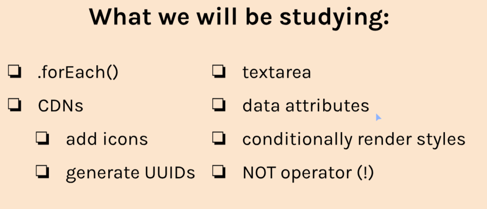
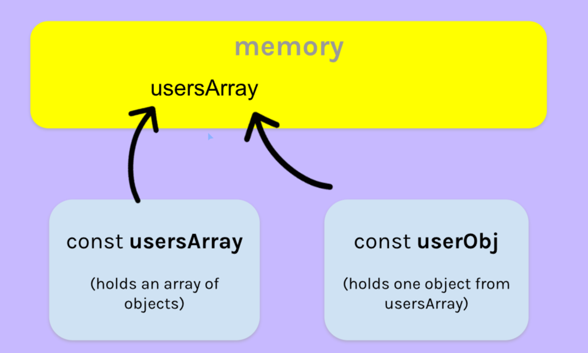

# Twimba Mod5. Sec3

Startedn 01/10/2024

Finished 01/14/2024

## Overview


## Aside: textarea
A multiline input field

Syntax:
```
<textarea 
placeholder="Ask me anything!"
id="chat-input"
></textarea>
```

Closing tag must share a line with opening tag, otherwise it breaks.

To grab the input with JS, use .value.

```
const chatInput = document.getElementById('chat-input')

console.log(chatInput.value)
```

To stop user from resizing text area edit CSS:
```
textarea{
    resize: none;
}
```

## Aside: .forEach()
A method for iterating over arrays

```
characters.forEach(function(character){
    console.log(character)
})

same as 
for (let character of characters){
    console.log(character)
}
```

Nested forEach:
```
characters.forEach(function(character){
    character.powers.forEach(function(power){
        console.log(power)
    })
})
```

A helpful feature is passing an index argument.
```
characters.forEach(function(character, index){
    console.log(index, character.title)
})

›0,"Ninja"
›1,"Sorcerer"
›2,"Ogre"
›3,"Unicorn"
```

## Data Attributes
Storing extra information in HTML elements

Syntax:
```
data-*

* stands for what you put.

Ex.
data-share="<set to what you want>"

<i class="fa-solid fa-share" data-share="image-1"></i>
```

To grab this data, we will pass event through an event listener.
```
console.log(e.target.dataset.share)
```

We have a problem though. Since we have this set up on a document event listener listening for a click, clicking anywhere on the page will log out undefined. Setting up an if statement which checks for the data existance will stop this.

```
document.addEventListener('click', function(e) {
    if (e.target.dataset.share){
        console.log(e.target.dataset.share)
    }
})
```

### Issues with names
You can use more than one word for names on data attributes.

- Dont use uppercase letters wehn naming dta attributes in HTML

Javascript will flatten camelcase to all lowercase. Causing confusion.

BEST PRACTICE

- Seperate words with dashes in the HTML
- Use camelCase in the JavaScript

## Filter return an object
We have learned the filter method before to sort through an array. To recap:
```
const targetTweetObj = tweetsData.filter(function(tweet){
        return tweet.uuid === tweetId
    })
```

However, this will return us an array. If we want to return just an object, add the index to the end of the function.

```
const targetTweetObj = tweetsData.filter(function(tweet){
        return tweet.uuid === tweetId
    })[0]
```

Since this array we are originally getting is a length of 1 (uuid is unique!) we use [0]

## Copying Objects & Arrays

JS:
```
const usersArray = [
    {
        userName: 'Tom',
        password: '123456'
    }
]

const userObj = usersArray[0]

userObj.userName = 'Wayne'

console.log(usersArray)
console.log(userObj)

```
When we console.log:
```
›[{userName: "Wayne", password: "123456"}]
›{userName: "Wayne", password: "123456"}
```

Huh, changing the "copy" of the usersArray also changed the data of usersArray!

This is because we made a shallow copy.

When we created our usersArray, it was saved in memory. When we created our copy and stored it in userObj, you would expect it to hold a seperate space in memory. However, this is not the case. Instead, userObj references the same space in memory as usersArray. 



There are ways to truly copy an array, which is called a deep copy.

## Conditionally Render CSS
Giving elements different classes under different conditions

First off,  have the CSS class you would like to add:
```
.liked{
    color: #f80000; /* red */
}
```

Set up an empty class variable, which will be edited when rendered on click.

```
<i class="fa-solid fa-heart ${heartClass}" data-heart="image-1"></i>
```

On first render, it will be empty. Now we set up our logic.

When our element is clicked, switch the boolean and render. In our render, we have an if statement which will add the class when boolean = true

```
let heartClass = ''
    
    if(isLiked){
        heartClass = 'liked'
    }
```

Otherwise, when false, the class will be removed on render.

## UUID
Universally Unique Identifiers

- A string of 36 characters
- Often used to identify pieces of data
- Highly likely to be globall unique

GUID is a synonym, Globally Unique Identifier

We can use a CDN to generate UUID's for us.

Version 4 UUIDs are:
- Randomly generated characters
- The current "go to" UUID for most situations

Popular tool for generation is UUID JS Module

Add this import to top of JS file. Make sure script type is module

https://github.com/uuidjs/uuid#cdn-builds