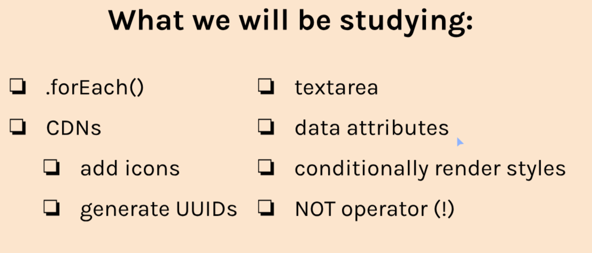

# Twimba Mod5. Sec3

Startedn 01/10/2024

Finished

## Overview


## Aside: textarea
A multiline input field

Syntax:
```
<textarea 
placeholder="Ask me anything!"
id="chat-input"
></textarea>
```

Closing tag must share a line with opening tag, otherwise it breaks.

To grab the input with JS, use .value.

```
const chatInput = document.getElementById('chat-input')

console.log(chatInput.value)
```

To stop user from resizing text area edit CSS:
```
textarea{
    resize: none;
}
```

## Aside: .forEach()
A method for iterating over arrays

```
characters.forEach(function(character){
    console.log(character)
})

same as 
for (let character of characters){
    console.log(character)
}
```

Nested forEach:
```
characters.forEach(function(character){
    character.powers.forEach(function(power){
        console.log(power)
    })
})
```

A helpful feature is passing an index argument.
```
characters.forEach(function(character, index){
    console.log(index, character.title)
})

›0,"Ninja"
›1,"Sorcerer"
›2,"Ogre"
›3,"Unicorn"
```