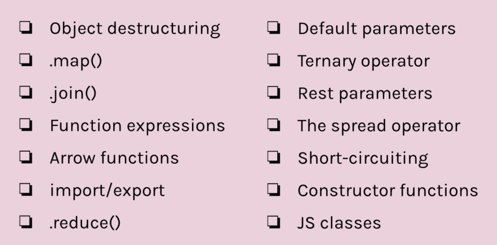
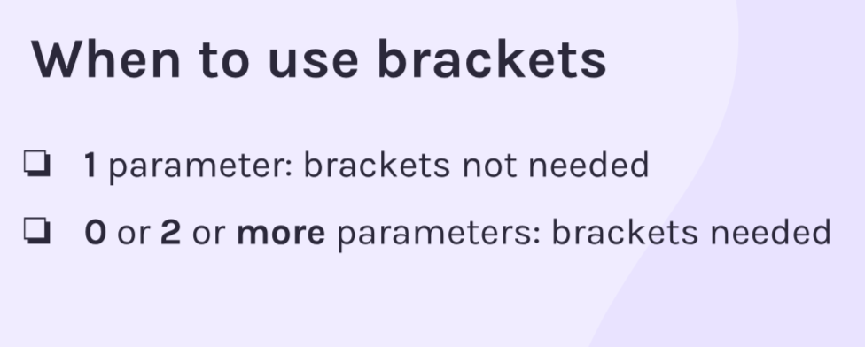
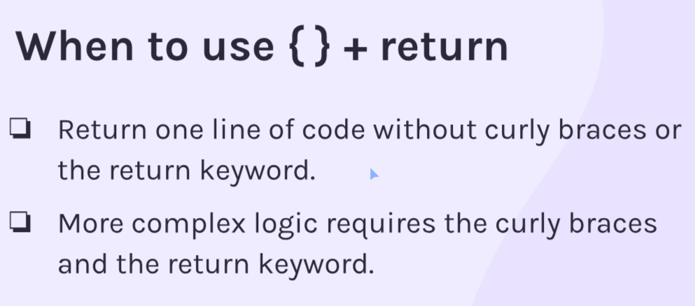

# Mini Projects Mod5. Sec4

Started 

Finished

## Overview



## Object Destructuring

Enables us to extract properties form objects into distinct variables
Data:
```
const favouriteFilm = {
    title: "Top Gun",
    year: "1986",
    genre: "action",
    star: "Tom Cruise",
    director: "Tony Scott"
} 
```
Instead of doing this:
```
 const title = favouriteFilm.title
 const year = favouriteFilm.year
 const genre = favouriteFilm.genre
 const star = favouriteFilm.star
 const director = favouriteFilm.director

 console.log(`My favourite film is ${title} starring ${star}. It's an ${genre} film that was directed by ${director} and released in ${year}.`)

```

We can do this:
```
const {title, year, genre, star, director} = favouriteFilm

console.log(`My favourite film is ${title} starring ${star}. It's an ${genre} film that was directed by ${director} and released in ${year}.`)
```

## .map() Method
Iterating over arrays

map() is the exact same as forEach(), however, it creates a new array with the applied function.

Syntax:
```
const distanceWalkedMilesArr = [140, 153, 161, 153, 128, 148]

const conversionFactorMilesToKm = 1.6

const distanceWalkedKmArr = distanceWalkedMilesArr.map(function(distanceMiles){
    console.log(distanceMiles)
})
```

We don't have to store this array in a const. Another example:
```
function convertMilesToKms() {
    return distanceWalkedMilesArr.map(function (distanceMiles, index) {
        return `Month ${index}: ${distanceMiles * conversionFactorMilesToKm}KM`
    })
}
```

## .join() Method
- Concatenates elements of array into a string
- Choose how elements are separated
- Returns the new stirng

```
const guestsArr = ['Amy', 'Clare', 'Keith', 'Dan'] 

console.log(guestsArr.join())
console.log(typeof guestsArr.join())

›Amy,Clare,Keith,Dan
›string
```

Used inverted commas to add a seperator between items. This adds a space.
```
console.log(guestsArr.join(' '))
```

Usually, we don't want any seperator. Provide an empty stirng.
```
console.log(guestsArr.join(''))
```

## .map() VS .forEach()

- forEach() returns undefinied. Can't chain methods on forEach since it returns undefinied.

- Use .map() when you need to make use of the returned arrray

- Use .forEach() if you don't need to create a new array

## For loop break and continue
Break will exit the current loop

Continue skips over the current iteration

```
const expensesAndRefunds = [
    { description: 'Groceries', amount: 50, year: 2023 },
    { description: 'Electronics', amount: -30, year: 2023 },
    { description: 'Dinner', amount: 40, year: 2023 },
    { description: 'Clothing', amount: 60, year: 2023 },
    { description: 'Entertainment', amount: 25, year: 2023 },
    { description: 'Rent', amount: -500, year: 2024 },
    { description: 'Utilities', amount: 100, year: 2024 },
    { description: 'Books', amount: 20, year: 2024 },
    { description: 'Fitness', amount: 30, year: 2024 },
    { description: 'Gifts', amount: 15, year: 2024 },
]

let totalSpent = 0
const cutoffDate = 2024

for (let i = 0; i < expensesAndRefunds.length; i++) {
    const currentExpenseOrRefund = expensesAndRefunds[i]
    
    if (currentExpenseOrRefund.year >= cutoffDate) {
        console.log(`Reached cutoff date, exiting loop`)
        break   
    }
    
    if (currentExpenseOrRefund.amount < 0) {
        console.log(`Skipping ${currentExpenseOrRefund.description} due to refund`)
        continue
    } 
    
    totalSpent += currentExpenseOrRefund.amount 
}


console.log(`Total amount spent on items in 2023: $${totalSpent}`)

›Skipping Electronics due to refund
›Reached cutoff date, exiting loop
›Total amount spent on items in 2023: $175
```

## Dangers of .innerHTML
Users can insert malicious JS. It's better to build the element manually

```
const newFilm = document.createElement('div')
newFilm.classList.add('film-item')
newFilm.textContent = filmInput.value
filmList.innerHTML += `
        <div class="film-item">${filmInput.value}</div>
        `
filmList.appendChild(newFilm)
```

## Function Expressions
Different syntax & behvaior

Function declarations are HOISTED. When code is executed, it is moved to the top. So, you can call a function before it's declared.

Here is a normal function declaration:
```
function getSpendAlert(amount) {
    return `Warning! You just spent £${amount}!`
}
console.log(getSpendAlert(100))
```

This would also work:
```
console.log(getSpendAlert(100))

function getSpendAlert(amount) {
    return `Warning! You just spent £${amount}!`
}
```

### Function Expression ex.
```
const getSpendAlert = function(amount){
    return `Warning! You just spent £${amount}!`
}
```

The advantage of function expressions:
- Are not hoisted
- Are cleaner and easier to read (argueable)
- Are the chosen style of some dev teams


## Arrow functions
Ultra concise functions

```
const getSpendAlert = function(amount){
    return `Warning! You just spent £${amount}!`
}
```

Basic arrow function
```
const getSpendAlert = (amount) => {
    return `Warning! You just spent £${amount}!`
} 
```

Concise arrow function (one argument)
```
const getSpendAlert = amount => {
    return `Warning! You just spent £${amount}!`
} 
```
Concise arrow function (two arguments)
```
const getSpendAlert = (name, amount) => {
    return `Warning! Hey ${name}! You just spent £${amount}!``
} 
```
No parameters:
```
const getSpendAlert = () => {
    return `Warning! You just spent £${amount}!`
} 
```

Guide:


### Most concise
Can get rid of {}, as well as return statement.
```
const getSpendAlert = amount => `Warning! You just spent £${amount}!`
```

HOWEVER, this only works with one line. If code block is more than 1 line, you need the {} 

Guide:


## Import and Export - Deep Dive
We can give the imported thing a new name using as. We can also easily import several things from one file with a comma.

```
import { interplanetaryDestinationsArr as destinations, shortSpaceTripsArr } from '/data.js'
```

We dont have to export each function/data indivudally by adding export to the front of declaration. Instead, add this to the bottom of the data file:
```
export { interplanetaryDestinationsArr, shortSpaceTripsArr }
```

## Default Export
We can skip some steps if we only want to export one thing.
```
export default function getMatchingTripsArr(){}
```

```
import getMatchingTripsArr from '/getMatchingTripsArr.js'
```

For the import statement, we can change the function name to anything. This can be confusing. Having the filename represent the original name is helpful. Remember, we can only use this once per file.

```
(function (a, b) {
  const chuck = 42;
  return a + b + chuck;
});

(a,b) => {
    const chuck = 42
    return a + b + chuck
}
```